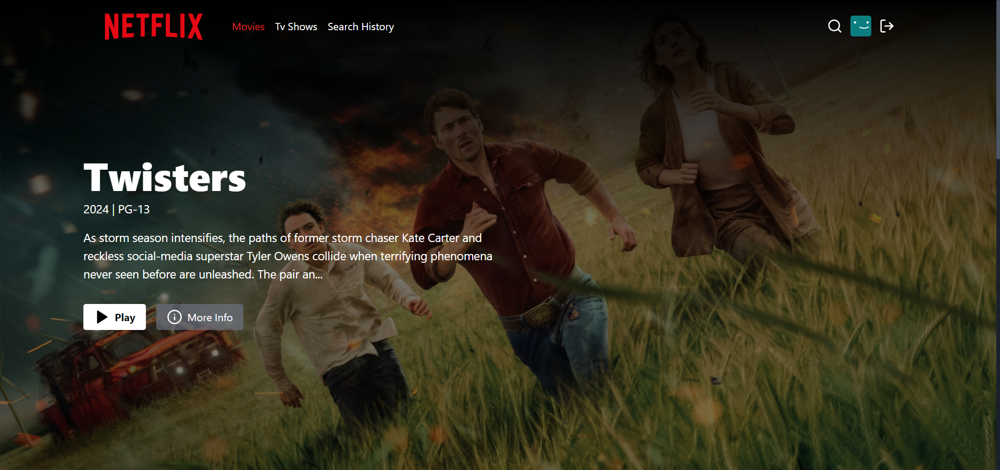

<h1 align="center">Fullstack Netflix Clone 🎬</h1>

## Overview

Welcome to the Netflix Clone project! This application is a full-stack web application built using the MERN (MongoDB, Express.js, React.js, Node.js) stack. It aims to replicate the core functionalities of Netflix, allowing users to browse, search, and stream videos. The project serves as an educational exercise to demonstrate proficiency in modern web development practices, including front-end and back-end development, state management, API integration, and responsive design.



## Demo

### [Netflix Clone](https://muneer-netflix-clone-xj0x.onrender.com/)

## Features

- 🔐Secure User Authentication and protected routes
- 📱 Responsive UI
- 🎬 Browse Movies and Tv Shows
- 🔎 Search for Movies, TV shows and actors
- 🎥 Watch Trailers
- 🔥 Search History
- 🐱‍👤 Get Similar Movies/Tv Shows
- 💙 Awesome Landing Page

## Tech Stack

### Frontend

- ⚛️ React
- ⚡ Vite
- 🐻 Zustand
- 🎨 Tailwind CSS

### Backend

- 🟢 Node.js
- 🚂 Express.js
- 🔑 JWT for authentication

### Database

- 🍃 MongoDB

### API

- 🎞️ TMDB

## Installation guide for local machine

1. **Clone this repo**

```bash
git clone https://github.com/MuneerHashmat/netflix-clone.git
```

2. **Set up environment variables** <br>

create a .env file on the root of the project and add the following variables:

```js
PORT = 5000;
MONGO_URI = your_mongo_uri;
NODE_ENV = development;
JWT_SECRET = your_jwt_secret;
TMDB_API_KEY = your_tmdb_api_key;
```

3. **Install backend dependencies**

```shell
npm install
```

4. **Install frontend dependencies**

```shell
cd frontend
npm install
```

5. **Run the server**

```shell
//root folder
npm run dev
```

6. **Run the frontend**

```shell
//frontend folder
npm run dev
```

<br>
<br>

# API Documentation

## Base url

```
https://muneer-netflix-clone-xj0x.onrender.com/
```

## Authentication

### Signup

- Endpoint

```
POST /api/v1/auth/signup
```

- Body

```json
{
  "username": "your_username",
  "email": "your_email@gmail.com",
  "password": "your_passowrd"
}
```

### Login

- Endpoint

```
POST /api/v1/auth/login
```

- Body

```json
{
  "email": "your_email@gmail.com",
  "password": "your_passowrd"
}
```

### Logout

- Endpoint

```
POST /api/v1/auth/logout
```

### Authentication check

- Endpoint

```
Get /api/v1/auth//authCheck
```

## Movies

**❗❗These are protected routes only accessible after authentication and cookie setting**

### Trending Movie

- Endpoint

```
GET /api/v1/movie/trending
```

### Trailers of a movie by id

- Endpoint

```
GET /api/v1/movie/trailers/:id
```

### Details of a movie by id

- Endpoint

```
GET /api/v1/movie/details/:id
```

### Similar movies by id

- Endpoint

```
GET /api/v1/movie/similar/:id
```

### Movie categories

- Endpoint

```
GET /api/v1/movie/category
```

## TV shows

**❗❗These are protected routes only accessible after authentication and cookie setting**

### Trending TV shows

- Endpoint

```
GET /api/v1/tv/trending
```

### Trailers of a tv show by id

- Endpoint

```
GET /api/v1/tv/trailers/:id
```

### Details of a tv show by id

- Endpoint

```
GET /api/v1/tv/details/:id
```

### Similar tv shows by id

- Endpoint

```
GET /api/v1/tv/similar/:id
```

### TV show categories

- Endpoint

```
GET /api/v1/tv/category
```

## Searching

**❗❗These are protected routes only accessible after authentication and cookie setting**

### Person

- Endpoint

```
GET /api/v1/search/person/:search_query
```

### Movie

- Endpoint

```
GET /api/v1/search/movie/:search_query
```

### TV show

- Endpoint

```
GET /api/v1/search/tv/:search_query
```

### Search history

- Endpoint

```
GET api/v1/search/history
```

### Delete item from search history

- Endpoint

```
GET /api/v1/search/history/:id
```
